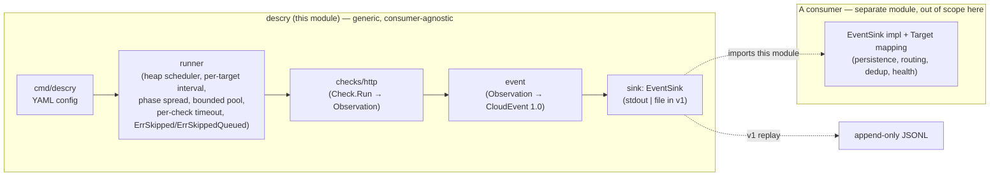

# descry architecture & the producer/consumer seam

`descry` is the **producer half** of a monitoring system: a `Check` runs against a
`Target`, produces an `Observation`, which is mapped to a **CloudEvents 1.0**
event and handed to an `EventSink`. The engine is **correct and generic**. It
carries tenancy and routing only as an **opaque `Labels` map** that it never
interprets, and it owes any particular consumer nothing.

This document is the **public seam contract**: where the engine's responsibility
ends and a consumer's begins. It names no specific downstream system on purpose —
the seam is defined by the interfaces, not by who implements them.

## The pipe

```
Check.Run ──▶ Observation ──▶ event.ToCloudEvent ──▶ EventSink.Publish
(checks/http)   (check)            (event)              (sink / consumer)
```



## Premise #4 — the seam litmus test

> **Any consumer-specific need must be expressible as an implementation of an
> engine interface (or a new `Extra`/`Labels` key), with _zero_ changes to the
> engine's exported types.**

If satisfying a downstream requirement means adding a typed field to
`Observation`, a method to `Check`, or a hook to the runner *for one consumer's
benefit*, **the seam is leaking — stop.** The correct move is almost always one
of:

- a new key in the opaque `Labels` map (carried through, never interpreted), or
- a new key in `Observation.Extra` (check-/consumer-specific payload), or
- a new `EventSink` / `Check` implementation in the consumer's own module, or
- an **external wrapper** around the runner (the consumer composes; the engine
  exposes no hook).

A genuinely *generic* HTTP output (one any HTTP monitor would emit) may become a
typed field — that's not a leak. The test is "generic to HTTP monitoring," not
"needed by my consumer."

### It governs *vocabulary*, not *surface*

Read the "zero changes to exported types" clause as the anti-leak rule it was
written to be: no tenancy identifiers, no site or account concepts, no
keyword-matching semantics in engine types. That part is absolute — no
performance win buys it.

The clause is **not** a promise never to change the exported API. Pre-1.0, a
change that is the obvious design for a general-purpose uptime engine may take a
minor version bump and migration notes. The bar is:

> Would an engineer who has never heard of any particular consumer look at this
> API and call it the obvious design for a general-purpose uptime engine?

A change passes if it is justifiable from prior art and the problem domain alone.
It fails if the only honest justification is "my consumer needed it." Where a
non-breaking form is equally natural, prefer it — gratuitous breakage is not a
benefit. Where breaking is genuinely the better design, take it, bump the minor
version, write the migration notes, and **update this document** so the contract
and the code stop disagreeing.

Worked example: `check.Target.Interval` (v0.3.0). Per-target cadence is what
Prometheus (`scrape_interval` per job), Blackbox Exporter, Uptime Kuma and
Checkly all expose; it is the standard shape of the domain, it carries no
consumer vocabulary, and it is additive. It changes surface, not vocabulary. ✅

## What the engine owns (never delegated)

| Concern | Owned by the engine because… |
| --- | --- |
| `Status` enum (`up`/`down` in v1) | Closed, typed set; consumers map *out* of it, never into it. |
| `ErrorClass` enum (closed set) | Engine-defined vocabulary. Lossy translation to a consumer's own error strings is the **consumer's** job. |
| The up/down boundary `[200, 400)` | A sane default codified numerically; not negotiable per consumer. |
| CloudEvent `id` (ULID) | **Authoritative.** Consumers do not mint their own id; any `(time, id)` cursor a consumer builds uses the engine's id directly. |
| `time` = `Observation.ObservedAt` | The authoritative timestamp a cursor orders on. |
| Best-effort produce semantics | Bounded retry, then log + continue; never blocks the scheduler, never silently drops. |
| Cadence and skip semantics | Per-target interval, wall-clock-anchored phase, and "a target is never run concurrently with itself." A missed slot is reported as `ErrSkipped` / `ErrSkippedQueued`, never swallowed; what to *do* about one is the consumer's call. See [OPERATIONS.md](OPERATIONS.md). |
| The CloudEvents 1.0 envelope shape | Pinned and snapshot-tested. |
| SSRF guard (best-effort) | App-layer guard, explicitly **not** a security boundary — see the README Security section. |

## What a consumer owns (engine stays out)

| Concern | Why it's the consumer's |
| --- | --- |
| Persistence (any database sink) | v1 ships **stdout + file only**. A generic Postgres sink graduates to this module as v2 *after* the contract is battle-tested behind a private adapter. |
| Tenancy / routing (`org_id`, RLS, `SET ROLE`) | Carried only as opaque `Labels`. The engine never reads them. |
| Translating `ErrorClass` → a consumer's own error vocabulary | Lossy and consumer-specific. |
| Deduplication | Keys on the authoritative `id`; a consumer's concern if it needs it. |
| Job-health / liveness reporting | The runner exposes `EventSink` **only** — no health hooks. A consumer wraps the runner **externally**. |
| Keyword / content matching | The engine captures body into `Extra.body`; comparison logic is consumer scope. |
| Cursor-based replay consumption | v1 demonstrates replay only via the append-only file sink. |

## The import boundary enforces the seam

The seam is not just documentation — it's **physically enforced by the module
boundary**. A consumer lives in a *separate module* and `import`s descry; descry
imports nothing back. If the engine ever needed to import a consumer, the seam
would already be broken. This is the strongest guarantee available: the
"consumer-agnostic" property is a compile-time fact, not a code-review aspiration.

## Worked example — `WithUserAgent` (the seam done right)

A consumer needed a configurable `User-Agent` to get past WAFs that 403 the
stdlib default (`Go-http-client/1.1`). The seam-respecting implementation:

- `httpcheck.New(timeout, ...Option)` gains a **generic functional option**,
  `WithUserAgent(string)`. A custom UA is generic to HTTP monitoring — any HTTP
  monitor might want one — so it's a legitimate engine feature, **not** a
  consumer-specific carve-out.
- The default is unchanged: empty UA → net/http's stdlib default. **The engine
  never impersonates a browser** unless the caller explicitly opts in.
- The engine learns nothing about *why* a consumer sets it. The WAF, the consumer,
  and its deployment are all invisible to descry. ✅ premise #4 holds.

Contrast with the leak it avoided: hard-coding a specific UA string, or adding a
`waf_mode bool` to `Observation`. Both would bake one consumer's deployment
reality into the generic engine.

---

*An internal, consumer-named version of this map lives at
`docs/internal/SEAM.md` (gitignored) for maintainers. It is deliberately kept out
of this public module to preserve the consumer-agnostic property described above.*
